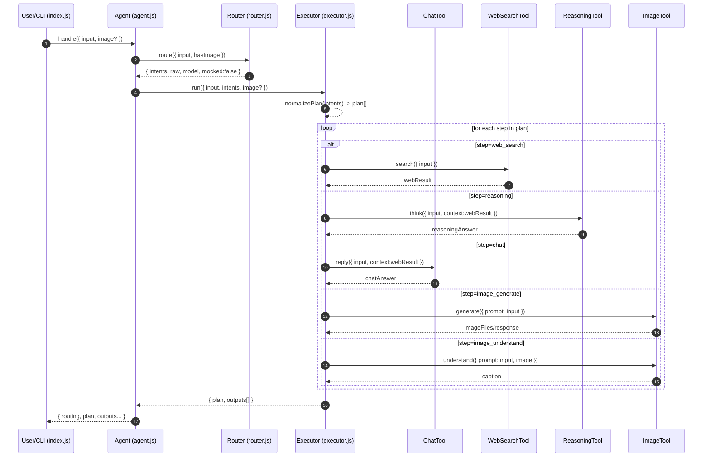

# AI Agent Demo

本项目实现一个**单 Agent 架构**的“可扩展、多模态 AI Agent”，使用 **JavaScript（Node.js / ES Modules）**，并严格按照分层架构组织代码：

- **Agent Core**
  - **Router（`router.js`）**：只做意图识别（不执行任何工具）
  - **Executor（`executor.js`）**：负责编排（planning + 顺序执行工具）
- **Tool Layer（`tools/`）**
  - `ChatTool`：普通对话
  - `WebSearchTool`：Web 搜索（`web_search_preview`）
  - `ReasoningTool`：深度思考/推理（`reasoning_effort`）
  - `ImageTool`：文生图 + 图像理解

---

## 1. 快速开始

### 1.1 环境要求

- Node.js 18+（推荐 20+）
- 已开通 OpenAI API/ Azure OpenAI API

### 1.2 安装依赖

```bash
npm install
```

### 1.3 配置环境变量（必须）

必需：

- `OPENAI_API_KEY`
- `OPENAI_BASE_URL`（示例：`https://xxx.openai.xxx.com`）

可选：

- `OPENAI_API_VERSION`（默认：`2025-04-01-preview`）
- `ROUTER_MODEL`（默认：`gpt-4.1`）
- `CHAT_MODEL`（默认：`gpt-4.1`）
- `REASONING_MODEL`（默认：`gpt-5.1`）
- `IMAGE_MODEL`（默认：`gpt-image-1`）

Azure 注意：

- 这里的 `model` **通常是你的 Azure Deployment 名称**（不是 OpenAI 公共模型名）。

### 1.4 运行

```bash
node index.js "hello"
```

---

## 2. 项目结构

```text
agent/
├── index.js              # CLI 入口：接收用户输入/图片并调用 Agent
├── agent.js              # Agent Core：整合 Router + Executor
├── router.js             # Router：意图识别（严格输出 JSON）
├── executor.js           # Executor：执行编排（plan + 顺序执行 Tool）
├── tools/
│   ├── openaiClient.js   # 统一创建 OpenAI 官方 SDK Client
│   ├── chatTool.js
│   ├── webSearchTool.js
│   ├── reasoningTool.js
│   └── imageTool.js
├── prompts/
│   ├── routerPrompt.txt
│   └── reasoningPrompt.txt
└── config.js             # API 配置 + model 配置 + env 校验
```

---

## 3. 整体工作流程（核心）

### 3.1 一句话版本

**`index.js` → `Agent.handle()` → `Router.route()` → `Executor.run(plan)` → Tools 顺序执行 → 输出结果**

### 3.2 时序图（Mermaid）



---

## 4. Agent Core 详细说明

### 4.1 `agent.js`（Agent）做什么？

Agent 是系统的“总入口”，它负责：

1. 调用 Router 获取意图（intents）
2. 将 intents 交给 Executor 编排执行
3. 合并 Router 与 Executor 的结果并返回

概念上的返回结构：

```js
{
  routing: { intents, raw, model, mocked },
  plan: [...],
  outputs: [...]
}
```

---

## 5. Router 详细说明（`router.js`）

### 5.1 Router 的职责

Router **只做意图识别**，必须遵守：

- 不调用 Tool
- 不做执行计划（plan）
- 输出必须是**严格 JSON**（由 prompt + `response_format` 约束）

### 5.2 Router 输入

Router 接收：

```js
route({
  input: string,
  hasImage?: boolean
})
```

- `input`：用户原始输入文本
- `hasImage`：是否带图片（由 CLI `--image` 传入）

### 5.3 Router 输出（非常重要）

Router 返回对象结构如下：

```json
{
  "intents": ["web_search"],
  "raw": { "intent": "web_search" },
  "model": "gpt-4.1",
  "mocked": false
}
```

字段解释：

- `intents`：**Executor 的唯一输入依据**，决定执行哪些工具
- `raw`：Router 模型输出的原始 JSON（便于调试回放）
- `model`：本次路由使用的 deployment
- `mocked`：固定为 `false`（本仓库无 mock）

### 5.4 Router 支持的 intent

允许的 intent（与 prompt 对齐）：

- `chat`
- `web_search`
- `reasoning`
- `image_generate`
- `image_understand`

### 5.5 Router Prompt

Router Prompt 位于：

- `prompts/routerPrompt.txt`

Router 使用：

- `response_format: { type: "json_object" }`

来强制模型输出 JSON。

---

## 6. Executor 详细说明（`executor.js`）

### 6.1 Executor 的职责

Executor 负责两件事：

1. **Planning（计划）**：把 Router 的 intents 转成可执行的 `plan[]`
2. **Execution（执行）**：按 plan 顺序调用 Tool，并把中间结果传递给后续步骤

> Router 不做计划，Tool 不做决策；只有 Executor 做编排。

### 6.2 Executor 输入

```js
run({
  input: string,
  intents: string[],
  image?: { data?: string, url?: string, mimeType?: string }
})
```

### 6.3 `plan` 是什么？

`plan` 是一个步骤数组，表示实际执行顺序，例如：

```js
["web_search", "reasoning"];
```

### 6.4 当前内置 Planning 规则（简单但好用）

当前 `#normalizePlan()` 主要规则（Router 优先，Executor 兜底）：

- Router 负责判断“搜索后用 chat 还是 reasoning”：
  - `intents: ["web_search","chat"]`：快速总结
  - `intents: ["web_search","reasoning"]`：深度分析/推理
- Executor 做兜底：如果 intents 中包含 `web_search`，但 Router 没有显式给出 `chat`/`reasoning`，则默认追加 `chat`
- 同时确保执行顺序：先 `web_search`，再 `reasoning/chat`

因此常见流程可能是：

- Router：`["web_search","chat"]` → Plan：`["web_search","chat"]`
- Router：`["web_search","reasoning"]` → Plan：`["web_search","reasoning"]`
- Router：`["web_search"]` → Plan（兜底）：`["web_search","chat"]`

### 6.5 Executor 输出

Executor 会返回（概念）：

```js
{
  input,
  image,
  web,        // 最近一次 web_search 的结果（便于后续工具使用）
  plan,       // 最终执行步骤
  outputs: [] // 每一步执行结果
}
```

其中 `outputs` 会包含每一步的结构化结果，例如：

```json
{
  "step": "web_search",
  "web": { "query": "...", "output_text": "..." }
}
```

以及：

```json
{
  "step": "reasoning",
  "answer": { "text": "..." }
}
```

提示：

- `index.js` 默认只打印最后一步 output（例如 reasoning/chat），中间步骤仍在 `outputs[]` 里。

---

## 7. Tool Layer 详细说明（`tools/`）

> 这表示这个 Demo 运行的模型必须要具备 Tool Calling 的能力

### 7.1 Tool 共同原则

每个 Tool 必须：

- 只有一个职责
- 不做意图判断
- 不做执行计划
- 只执行 Executor 调用的任务

### 7.2 `tools/openaiClient.js`（真实 OpenAI Client）

职责：

- 校验 env 是否齐全（`assertOpenAIConfig()`）
- 构造官方 SDK Client：

```js
new OpenAI({
  apiKey: process.env.OPENAI_API_KEY,
  baseURL: `${process.env.OPENAI_BASE_URL}/openai/v1/`,
});
```

### 7.3 ChatTool（`tools/chatTool.js`）

用途：

- 低成本对话

```js
client.chat.completions.create({
  model,
  messages: [{ role: "user", content: input }],
});
```

### 7.4 WebSearchTool（`tools/webSearchTool.js`）

用途：

- Web 搜索

```js
client.responses.create({
  model,
  tools: [{ type: "web_search_preview" }],
  input,
});
```

返回包含：

- `output_text`：模型聚合后的搜索输出（常用于后续 summary）
- `response`：完整 raw response（便于扩展二次处理）

### 7.5 ReasoningTool（`tools/reasoningTool.js`）

用途：

- 深度推理（step-by-step）

```js
client.chat.completions.create({
  model,
  messages,
  reasoning_effort: "medium",
});
```

Prompt：

- `prompts/reasoningPrompt.txt`

### 7.6 ImageTool（`tools/imageTool.js`）

#### 7.6.1 文生图（generate）

```
POST {OPENAI_BASE_URL}/openai/deployments/{IMAGE_MODEL}/images/generations?api-version=...
Headers: Api-Key: {OPENAI_API_KEY}
```

会把 base64 PNG 保存到本地：

- `generated_image_1.png`

#### 7.6.2 图像理解（understand）

调用方式：

- `chat.completions` 传入 `image_url`（data url base64）

CLI 传图：

- `node index.js "这张图里有什么" --image ./a.png`

---

## 8. 常用运行示例

### 8.1 Chat

```bash
node index.js "hello"
```

### 8.2 WebSearch → Reasoning

```bash
node index.js "调用web search 搜索一下有什么好看的新闻吧？"
```

### 8.3 图像理解

```bash
node index.js "这张图里有什么？" --image ./test.png
```

---

## 9. 扩展新能力（推荐流程）

新增一个能力的标准步骤：

1. 在 `prompts/routerPrompt.txt` 增加新的 intent
2. 在 `tools/` 新增一个 Tool 文件（单职责）
3. 在 `executor.js` 注册 tool 并实现对应 step 分支
4. 如需多步工作流，在 `#normalizePlan()` 中增加规划规则

建议：

- Tool API 保持稳定：`tool.run({ input, context })`
- Planning 尽量确定性（避免隐式“自作主张”）

---

## 10. Troubleshooting

### 10.1 缺少环境变量

报错：

`Missing required env vars: ...`

请检查：

- `OPENAI_API_KEY`
- `OPENAI_BASE_URL`

### 10.2 Deployment not found

请确认以下 env 值是 OpenAI 有效的模型：

- `ROUTER_MODEL`
- `CHAT_MODEL`
- `REASONING_MODEL`
- `IMAGE_MODEL`

### 10.3 web_search_preview 不可用

部分模型可能不支持 `web_search_preview`, 这个就要自行调整一下了
