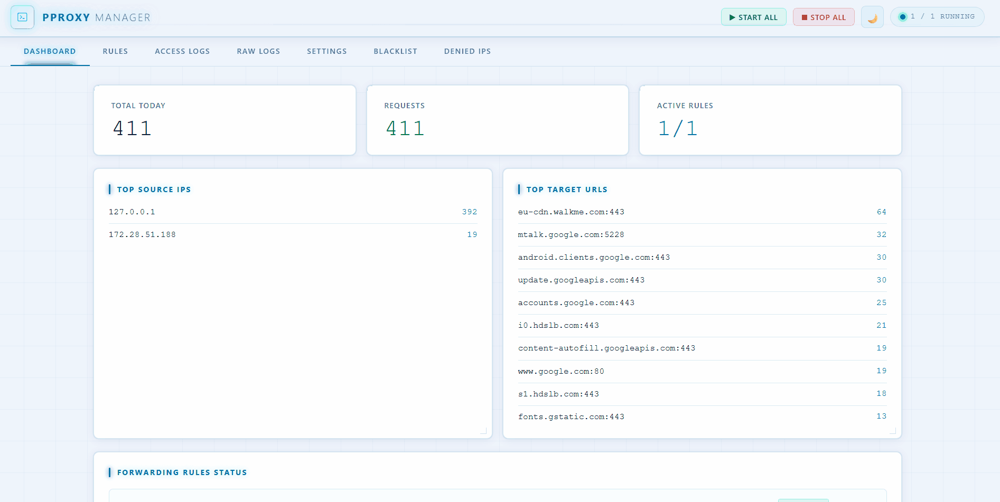

# pproxy Manager

A lightweight Python web application for managing and monitoring multiple [pproxy](https://github.com/qwj/python-proxy) forwarding rules. Browser-based UI, structured access logging, and real-time process monitoring.



---

## Requirements

- Python 3.10+
- pip

---

## Project Structure

```
.
├── main.py                  # aiohttp server — routes and startup/shutdown hooks
├── store.py                 # File-based persistence (JSON / JSONL)
├── watchdog.py              # Async pproxy process manager (one task per rule)
├── requirements.txt
├── data/                    # Auto-created on first run
│   ├── rules.json
│   ├── settings.json
│   ├── blocklist.txt            # Auto-generated regex file passed to pproxy -b
│   └── logs/
│       ├── access_YYYY-MM-DD.log   # Structured access log (JSONL)
│       └── raw_YYYY-MM-DD.log      # Raw pproxy stdout
└── web/
    └── index.html           # Single-page frontend (pure CSS, no build tools)
```

---

## Web UI

| Tab             | Description                                                                  |
| --------------- | ---------------------------------------------------------------------------- |
| **Dashboard**   | Live rule status, today's request stats, top IPs and URLs                    |
| **Rules**       | Create, edit, delete, start, stop, restart forwarding rules                  |
| **Access Logs** | Paginated log query — filter by IP, URL, and date; timestamps in CST (UTC+8) |
| **Raw Logs**    | Real-time pproxy stdout, auto-refreshes every 3 seconds                      |
| **Settings**    | Backoff parameters, log retention, pproxy path, port                         |
| **Blacklist**   | Block proxy destinations (domains/hosts) — passed to pproxy via `-b` flag    |
| **Denied IPs**  | Block source IPs from accessing this management web UI                       |

The UI supports **dark and light modes** — toggle via the button in the header; preference is saved to `localStorage`.

---

## Step-by-Step Usage Guide

### 1. Install and start

```bash
pip install -r requirements.txt
python main.py
```

Open **http://localhost:20088** in your browser. The port can be changed later in the Settings tab.

---

### 2. Create your first proxy rule (Rules tab)

A **rule** tells pproxy to listen on a local address and forward traffic to a remote server.

1. Click the **Rules** tab.
2. Click **New Rule**.
3. Fill in the form:

   | Field              | Example                  | Notes                                                          |
   | ------------------ | ------------------------ | -------------------------------------------------------------- |
   | **Name**           | `My HTTP Proxy`          | Optional label — for your reference only                       |
   | **Listen**         | `http://0.0.0.0:8080`    | Protocol + address + port where pproxy will accept connections |
   | **Remote**         | `socks5://10.0.0.1:1080` | Upstream proxy to forward traffic through                      |
   | **Alive Interval** | `30`                     | Seconds between keepalive probes (0 to disable)                |
   | **Verbose**        | enabled                  | Enables pproxy `-v` flag so connections appear in logs         |
   | **Enabled**        | enabled                  | Auto-starts this rule when the server starts                   |

4. Click **Save**. The rule starts automatically if **Enabled** is checked.

**Rule status badges:**

| Badge        | Meaning                                           |
| ------------ | ------------------------------------------------- |
| `running`    | pproxy subprocess is active                       |
| `stopped`    | Manually stopped or disabled                      |
| `restarting` | pproxy exited unexpectedly; backoff timer running |
| `error`      | Fatal error (e.g. pproxy executable not found)    |

You can **Start / Stop / Restart** individual rules using the buttons in each row, or use **Start All / Stop All** at the top of the tab.

---

### 3. Monitor traffic (Dashboard tab)

The **Dashboard** shows:

- **Running / Total** rule count at a glance.
- **Today's stats**: total requests, blocked requests, allowed requests.
- **Top 10 source IPs** by request count.
- **Top 10 target URLs** by request count.

The page refreshes automatically every 5 seconds.

---

### 4. Search access logs (Access Logs tab)

Each connection forwarded by a running rule is recorded as a structured log entry.

Filters available:

| Filter           | Description                                       |
| ---------------- | ------------------------------------------------- |
| **Date**         | Pick any past date (defaults to today)            |
| **Source IP**    | Filter by client IP (partial match)               |
| **Target URL**   | Filter by destination host/URL (case-insensitive) |
| **Blocked only** | Show only connections that matched the blacklist  |

Results are paginated (50 per page by default). Timestamps are displayed in CST (UTC+8).

---

### 5. View raw logs (Raw Logs tab)

Shows the last 100 lines of raw pproxy stdout for today. This includes startup messages, connection lines, and any errors printed by pproxy. The view auto-refreshes every 3 seconds.

Useful for debugging when a rule is in `error` or `restarting` state.

---

### 6. Block proxy destinations (Blacklist tab)

The **Blacklist** controls what the _proxy itself_ is allowed to forward. Entries are regex patterns matched against the target host/URL. Blocked connections are recorded in the access log with `"blocked": true`.

Internally, patterns are written to `data/blocklist.txt` and passed to every running pproxy instance via the `-b` flag. All running rules restart automatically when the blacklist changes.

**To add an entry:**

1. Click **Add Pattern**.
2. Enter a regex pattern, e.g. `example\.com` or `.*\.ads\..*`.
3. Optionally add a comment.
4. Click **Save**. Running rules restart to apply the change immediately.

> This blocks _traffic flowing through the proxy_, not access to this management UI.
> To block access to the UI itself, use the **Denied IPs** tab instead.

---

### 7. Restrict web UI access (Denied IPs tab)

The **Denied IPs** list controls which IP addresses can access this management web server. Any request from a listed IP receives a `403 Forbidden` response before it reaches any API or UI.

**To block an IP:**

1. Click the **Denied IPs** tab.
2. Click **Add IP**.
3. Enter the exact IPv4 address (e.g. `192.168.1.50`).
4. Click **Save**.

**Important limitations:**

- Exact IPv4 match only — no CIDR ranges, no wildcards, no IPv6.
- The check uses the direct TCP connection IP (`request.remote`). If this server is behind a reverse proxy, all requests appear to come from the proxy's IP.
- **Do not add your own IP** — you will lock yourself out immediately. If this happens, edit `data/settings.json` directly, clear the `"denied_ips"` array, and restart the server.

**Emergency recovery if locked out:**

```json
// data/settings.json — set denied_ips to an empty array
{
  "denied_ips": []
}
```

Then restart `python main.py`.

---

### 8. Adjust global settings (Settings tab)

| Setting               | Default   | Description                                                       |
| --------------------- | --------- | ----------------------------------------------------------------- |
| **Web Port**          | `20088`   | Port the management server listens on (requires restart to apply) |
| **pproxy Executable** | _(empty)_ | Path to the pproxy binary. Empty = use `python -m pproxy`         |
| **Backoff Min (s)**   | `1`       | Minimum wait before restarting a crashed rule                     |
| **Backoff Max (s)**   | `60`      | Maximum wait cap for exponential backoff                          |
| **Backoff Factor**    | `2.0`     | Multiplier applied after each restart attempt                     |
| **Log Retain Days**   | `7`       | Log files older than this are deleted on startup                  |

Click **Save Settings** to apply. The backoff and log-retention values take effect immediately; the port change requires a server restart.

---

## Data Storage

Plain files, no database.

| File                              | Format      | Description                                               |
| --------------------------------- | ----------- | --------------------------------------------------------- |
| `data/rules.json`                 | JSON Array  | Rule definitions                                          |
| `data/settings.json`              | JSON Object | Global configuration                                      |
| `data/blocklist.txt`              | Plain text  | Auto-generated; one regex per line, passed to pproxy `-b` |
| `data/logs/access_YYYY-MM-DD.log` | JSONL       | One record per forwarded connection                       |
| `data/logs/raw_YYYY-MM-DD.log`    | Plain text  | Raw timestamped pproxy output                             |

Log files older than `log_retain_days` are deleted automatically on startup.

---

## Supported Protocols

Any protocol supported by pproxy:

```
http://       HTTP proxy
socks5://     SOCKS5 proxy
tunnel://     Raw TCP tunnel
ss://         Shadowsocks
```

See the [pproxy docs](https://github.com/qwj/python-proxy) for the full list.

---

## Error Handling

| Scenario             | Behaviour                                             |
| -------------------- | ----------------------------------------------------- |
| pproxy not found     | Rule status → `error`, no restart attempted           |
| pproxy crashes       | Exponential backoff-restart (capped at `backoff_max`) |
| Unparseable log line | Stored as raw log only, structured fields skipped     |
| Web API exception    | `{"ok": false, "error": "..."}` + HTTP status code    |

## Installation

```bash
pip install -r requirements.txt
```

`requirements.txt` installs:

- `aiohttp` — web server
- `pproxy` — the proxy engine

---

## Running

```bash
python main.py
```

Open **http://localhost:20088** in your browser.

---

## Running with an Embedded / Portable Python

If you are using a standalone Python (e.g. the Windows embeddable package or a Linux tarball) and want the dependencies installed locally without touching the system Python:

### Windows — embeddable package

Download `python-3.x.x-embed-amd64.zip` from https://www.python.org/downloads/windows/ and extract it, for example to `python/python-3.13.2-embed-amd64/`.

**1. Edit `python313._pth`**

Open `python/python-3.13.2-embed-amd64/python313._pth` in any text editor and make two changes:

```
# 1. uncomment the last line so site-packages is visible
import site

# 2. add ../.. so Python can find main.py / store.py / watchdog.py
#    (path is relative to python.exe, so ../.. = project root)
```

The final file should look like this:

```
python313.zip
.
..\..

# Uncomment to run site.main() automatically
import site
```

> Without `import site` pip-installed packages are invisible.
> Without `../..` running `python.exe main.py` from the project root gives `ModuleNotFoundError: No module named 'store'`.

**2. Install pip** (not included in the embeddable package)

```powershell
curl -sSL https://bootstrap.pypa.io/get-pip.py -o get-pip.py
.\python\python-3.13.2-embed-amd64\python.exe get-pip.py
del get-pip.py
```

**3. Install dependencies**

```powershell
.\python\python-3.13.2-embed-amd64\python.exe -m pip install -r requirements.txt
```

**4. Run**

```powershell
.\python\python-3.13.2-embed-amd64\python.exe main.py
```

---

### Linux — local venv or portable Python

Same idea, using a virtualenv:

```bash
python3 -m venv venv
source venv/bin/activate
pip install -r requirements.txt
python main.py
```

Or pointing directly at any Python binary:

```bash
/path/to/your/python -m pip install -r requirements.txt
/path/to/your/python main.py
```

---
